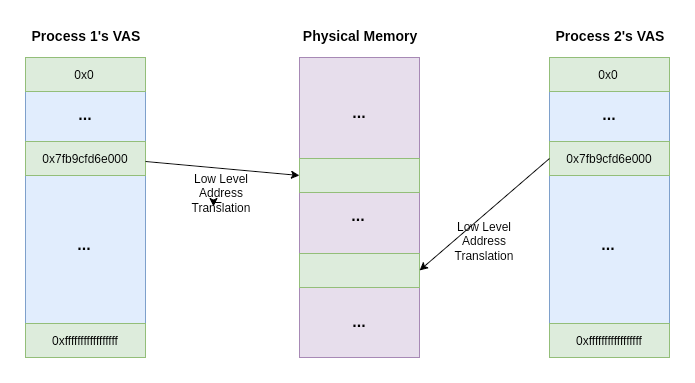

# Observations from Setup

I needed to compile the kernel for an x86 system, but I use an ARM-based Mac.

## Orbstack

 - initramfs (**init**ial **RAM** **f**ile**s**ystem) - temporary filesystem (tmpfs, in-memory) that the linux kernel loads into RAM on boot.

It mounts the real root (root = top level directory in any filesystem), especially when there are complex configurations. It loads the drivers (kernel modules) for different filesystems / hardware that aren't built directly into the kernel. 

initramfs images - may be a cpio archive - a stream of all the directories and files concatenated together, with headers containing metadata such as file names. This archive is "unpacked" into the RAM during boot.

initrd was the ancestor of initramfs. It used to be an actual filesystem image (with superblocks, inodes and stuff).

 - RAID (Redundant Array of Independent Disks) - array of independent physical drives as a single logical unit.

#### Linux Memory Stuff

 - physical and virtual memory

Physical memory is:
	- a limited resource 
	- not necessarily contiguous (is accessible as a set of distinct address ranges)
	- different architectures (and even different implementations of the same architecture) may define these address ranges differently
	- RAM is small and limited. It’s also “random access” (the processor can access all memory locations in the RAM equally fast).  So there’s a bunch of processes all vying for a slice of this RAM. That makes things complicated from the process POV. If it has to constantly track exactly which physical RAM addresses it has access to, which are free, and you have to make sure no processes overwrite each other’s locations and stuff…
	TL/DR: dealing with physical memory directly is complex.
	So we offload all that to the kernel, via virtual memory.

Virtual memory is an abstraction of physical memory, that all applications see.
They use virtual addresses that are translated to physical addresses.

Every process gets its own private virtual address space.

Each process lives in a sandbox, believing it has complete, unrestricted access to all addresses from 0x0 - 0xffffffffffffffff (all possible addressable memory). Processes aren't even aware of, and cannot access, the virtual address space of another process.

So processes and their programmers don't have to worry about low-level memory stuff, they interact with this Virtual Address Space and the kernel handles the rest.

Note: There's some confusion between how "virtual memory" sometimes refers to the concept of secondary memory devices such as SSD being seen as a part of the "main memory" by the kernel. 
So: the kernel CAN map virtual addresses to the disk. Less important, less used data can be mapped to slow disk rather that precious, scarce RAM. This is a PART of the virtual memory concept, but the MAIN thing is the abstraction of physical memory for processes. 

For example, if during a running process you see this via strace:

mmap(NULL, 180840, PROT_READ, MAP_PRIVATE, 3, 0) = 0x7f9ab51e1000

> mmap: syscall to map a file into a process’ virtual memory space

> arg1: address to map to, if NULL, kernel can choose it

> arg2: length in bytes to map

> arg3: desired memory protection, to decide permissions and stuff

> arg4: flags, stuff about how these mappings are (shared / private) for other processes mapping to this region

> arg5: file descriptor, here it is “3” because a previous syscall assigned that file to “3”

> arg6: offset in file

> 0x7f9ab51e1000 - this is the address the kernel selected in the VAS (because 1st arg was NULL)

The kernel code is also mapped into the process' Virtual Address Space to avoid context-switching overhead (we have plenty of space in the VAS anyway). So the VAS is split into two sections: User VAS and Kernel VAS.

